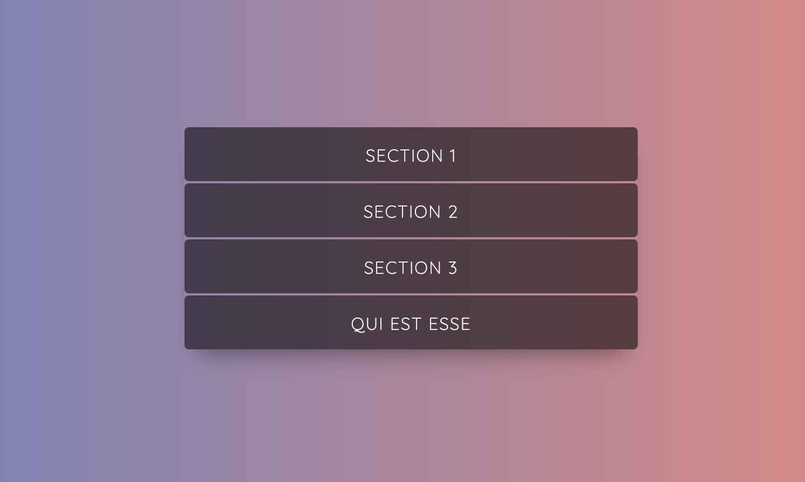

# Adevinta's frontend exercice

This repository contains my solution to the frontend exercice proposed by Adevinta (https://github.com/scm-spain/Frontend-Exercise)

See deployed version [here](https://gcelma.github.io/)



## Instructions

With the next markup, you must create an accordion (JS / CSS) show only the contents of a section at a time.
Sure to follow the [SUIT](https://suitcss.github.io/) convention when working with CSS.


```html
<dl>
  <dt>Section 1</dt>
  <dd>
    <p>Section 1 Content...</p>
  </dd>
  <dt>Section 2</dt>
  <dd>
    <p>Section 2 Content...</p>
  </dd>
  <dt>Section 3</dt>
  <dd>
    <p>Section 3 Content...</p>
  </dd>
</dl>
```

### Conditions
* Use Sass for generate CSS
* Use ES6
* Use only Vanilla JS, without any JS framework
* Generate gh-page for publish


### Bonus
* Add new section with Ajax content


## Instalation

Install dependencies: 
```sh
npm i
```

Build dist folder: 
```sh
npm run build
```

Launch local server: 
```sh
npm run dev
```

Demo is available at http://localhost:8080/


## Testing

To launch test: 
```sh
npm test
```